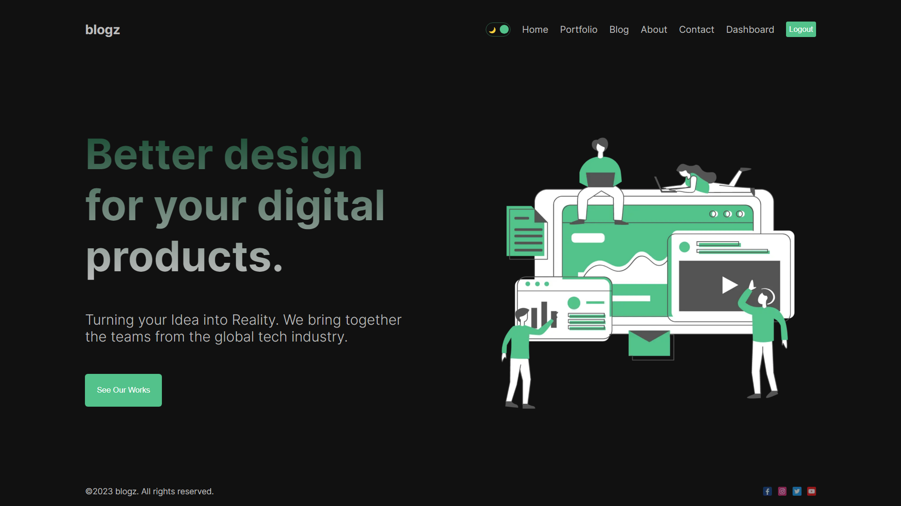
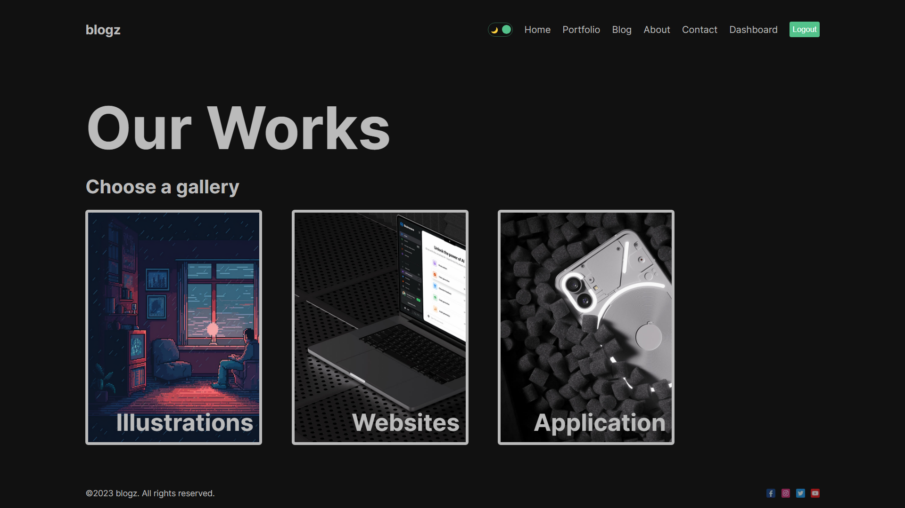
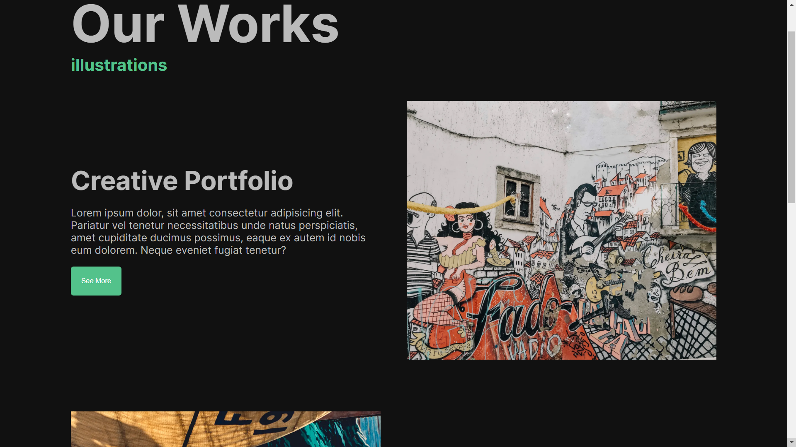
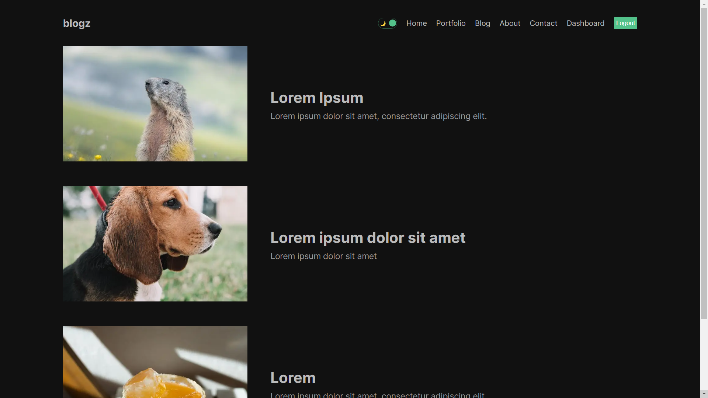
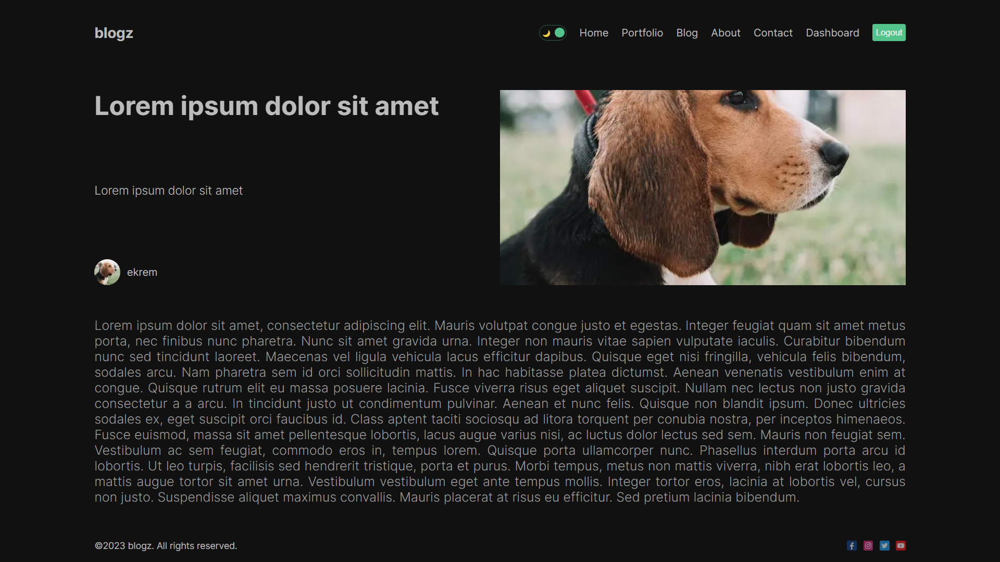
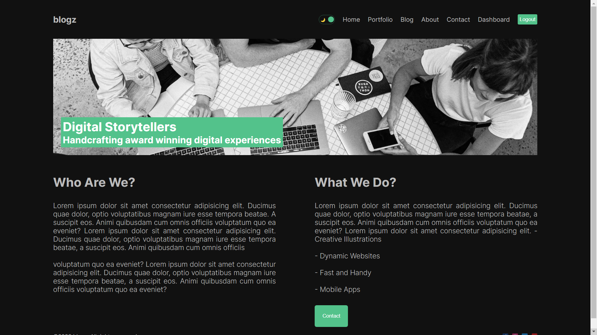
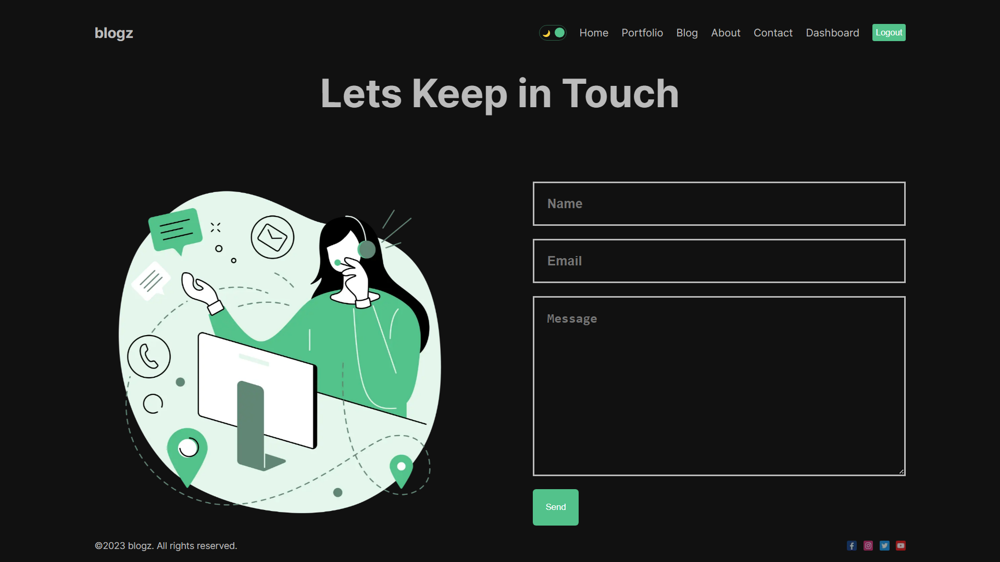
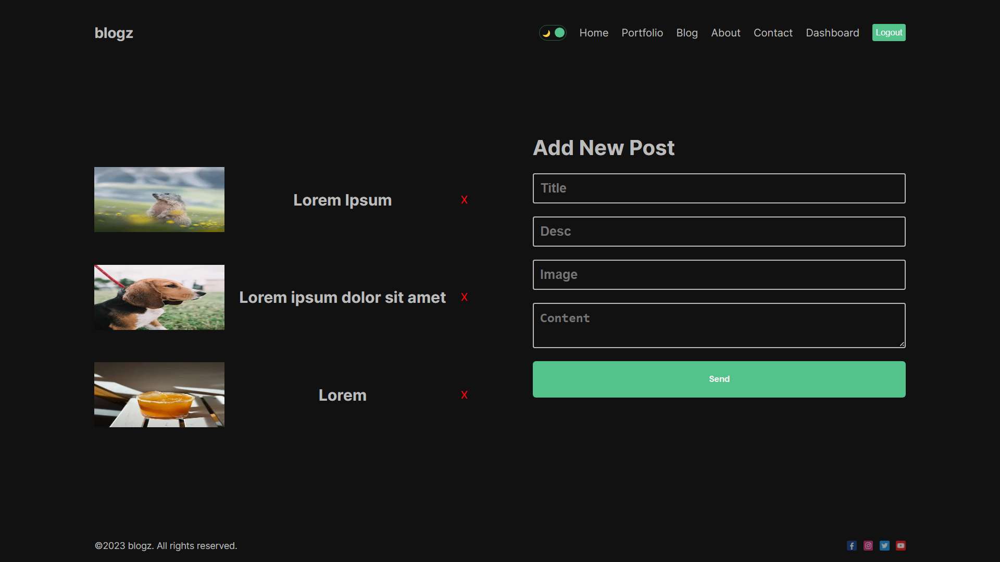
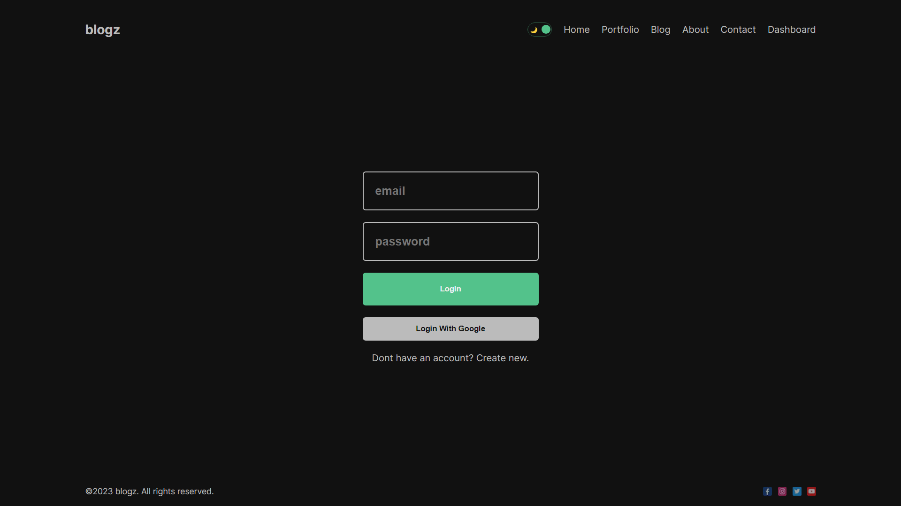
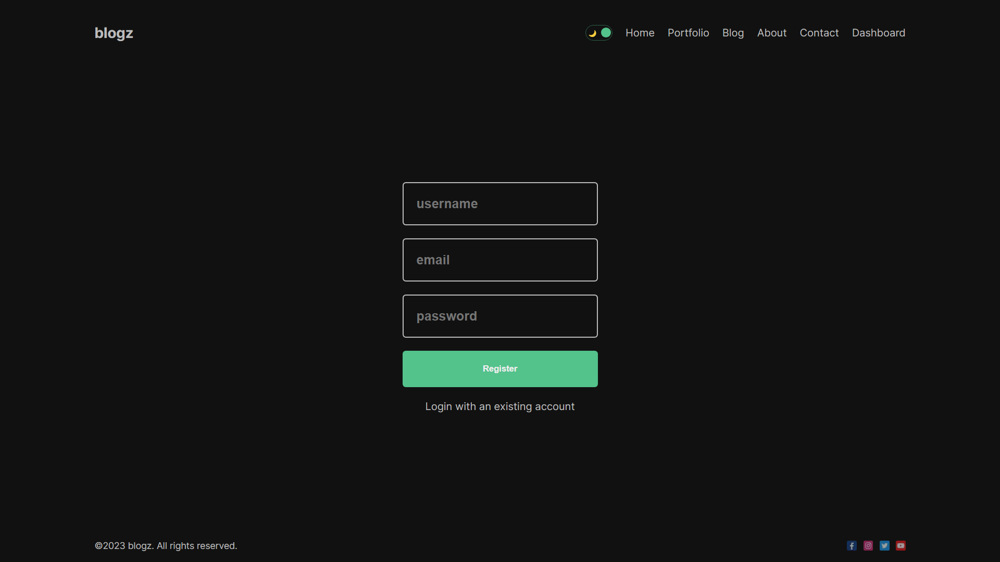

# [blogz](https://blogz-phi.vercel.app/)

Create a full stack blog app using Next.js 13 App Router, Auth.js, MongoDB, SSR, CSR components.

[](https://blogz-phi.vercel.app/)

## Running Locally

### Cloning the repository the local machine.

```bash
git clone
```

### Storing API key in .env file.

Create a file in root directory of project with env. And store your API key in it, as shown in the .example.env file.

### Installing the dependencies.

```bash
npm install
```

### Running the application.

Then, run the application in the command line and it will be available at `http://localhost:3000`.

```bash
npm run dev
```
 
## Deploy

When deploying on Vercel also include the Environmentable Variables.

## Powered by

This example is powered by the following 4 services:

- [Mongoose](https://mongoosejs.com)
- [SWR](https://swr.vercel.app)
- [Next Auth](https://next-auth.js.org/)
- [bcryptjs](https://www.npmjs.com/package/bcryptjs)
- [Vercel](https://vercel.com)

## Screenshots











